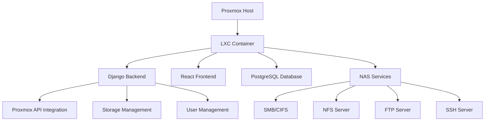

# MoxNas - Professional NAS Management for Proxmox

[](LICENSE)
[](https://www.proxmox.com/)
[](https://python.org)
[](https://reactjs.org)

## 🎯 Project Overview

**MoxNas** is a comprehensive Network Attached Storage (NAS) management solution specifically designed for Proxmox Virtual Environment. It provides a TrueNAS-like experience through containerized deployment, offering enterprise-grade storage management, user administration, and service orchestration within LXC containers.

### 🚀 Key Features

- **🖥️ Modern Web Interface** - React-based dashboard with real-time monitoring
- **📦 Containerized Architecture** - Runs entirely in LXC containers on Proxmox
- **🔧 Complete NAS Services** - SMB/CIFS, NFS, FTP, SSH, iSCSI support  
- **👥 Advanced User Management** - Users, groups, ACLs with filesystem integration
- **💾 Storage Management** - Datasets, shares, mount points, usage monitoring
- **🔗 Proxmox Integration** - Native API integration for container management
- **📊 Real-time Monitoring** - System performance, service status, resource usage
- **⚡ One-Command Installation** - Automated environment detection and deployment

## 🏗️ Architecture



### Technology Stack

**Backend:**
- Django 4.2+ with REST Framework
- PostgreSQL database
- Gunicorn WSGI server
- Celery for background tasks

**Frontend:**
- React 18+ with hooks
- TailwindCSS for styling
- Axios for API communication
- Real-time WebSocket updates

**Infrastructure:**
- LXC containerization
- systemd service management  
- Nginx reverse proxy
- Ubuntu 22.04 base system

## 🎯 Use Cases

### Enterprise Environments
- **Corporate File Sharing** - Centralized document storage with ACL controls
- **Development Teams** - Source code repositories and build artifact storage
- **Media Production** - Large file handling with high-performance access
- **Backup Solutions** - Automated backup scheduling and retention policies

### Home/SMB Networks  
- **Personal Cloud Storage** - Family photos, documents, media streaming
- **Home Lab Management** - Container orchestration and resource monitoring
- **IoT Data Collection** - Sensor data aggregation and analysis
- **Media Server Backend** - Plex/Jellyfin storage management

### Educational Institutions
- **Student File Systems** - User quota management and access controls
- **Research Data Storage** - Large dataset management with collaboration features
- **Lab Environment Management** - Isolated container environments for courses

## 🔧 Installation Methods

### One-Command Installation (Recommended)
```bash
curl -sSL https://raw.githubusercontent.com/Mezraniwassim/MoxNas/master/install-moxnas.sh | bash
```

### Manual Installation
```bash
git clone https://github.com/Mezraniwassim/MoxNas.git
cd MoxNas
chmod +x scripts/install_moxnas.sh
./scripts/install_moxnas.sh [container_id]
```

### Development Setup
```bash
# Backend
cd backend
python3 -m venv venv
source venv/bin/activate
pip install -r requirements.txt
python manage.py migrate
python manage.py runserver

# Frontend  
cd frontend
npm install
npm start
```

## 🌟 What Makes MoxNas Unique

### Proxmox-Native Design
Unlike generic NAS solutions, MoxNas is built specifically for Proxmox environments:
- **Container-First Architecture** - Leverages LXC for isolation and efficiency
- **Proxmox API Integration** - Direct management of containers and resources
- **Host Storage Integration** - Seamless access to Proxmox storage pools
- **Network Bridge Configuration** - Automatic network discovery and setup

### Enterprise-Grade Features
- **Advanced ACL System** - Fine-grained permission controls
- **Audit Logging** - Complete activity tracking and compliance
- **High Availability** - Container migration and failover support
- **Performance Monitoring** - Real-time metrics and alerting

### Developer-Friendly
- **RESTful API** - Complete programmatic access
- **Modern Tech Stack** - Django + React for maintainability  
- **Comprehensive Testing** - Automated test suites and CI/CD
- **Extensible Architecture** - Plugin system for custom functionality

## 📊 System Requirements

### Minimum Requirements
- Proxmox VE 8.0+
- 2GB RAM (4GB recommended)
- 8GB storage space
- Ubuntu 22.04 LXC template

### Recommended Configuration
- 4GB+ RAM for optimal performance
- SSD storage for database operations
- Dedicated network interface
- Regular backup configuration

## 🔒 Security Features

- **Multi-Factor Authentication** - TOTP and hardware key support
- **SSL/TLS Encryption** - HTTPS by default with Let's Encrypt integration
- **Input Validation** - SQL injection and XSS protection
- **Access Logging** - Comprehensive audit trails
- **Container Isolation** - LXC security boundaries
- **Role-Based Access Control** - Granular permission system

## 🚀 Performance Optimizations

- **Database Query Optimization** - Efficient data retrieval patterns
- **Frontend Code Splitting** - Lazy loading for faster initial loads
- **Memory Management** - Optimized container resource allocation
- **Caching Strategies** - Redis integration for session management
- **Background Processing** - Async task handling with Celery

## 🤝 Contributing

We welcome contributions from the community! See our [Contributing Guide](CONTRIBUTING.md) for details.

### Development Roadmap
- [ ] **Cloud Integration** - AWS S3, Azure Blob, Google Cloud Storage
- [ ] **Backup Automation** - Scheduled backups with retention policies  
- [ ] **Monitoring Dashboard** - Grafana integration for metrics visualization
- [ ] **Mobile App** - iOS/Android companion application
- [ ] **Plugin System** - Third-party extension framework

## 📚 Documentation

- [Installation Guide](docs/installation.md)
- [API Reference](docs/api.md)  
- [User Manual](docs/user-guide.md)
- [Administrator Guide](docs/admin-guide.md)
- [Troubleshooting](docs/troubleshooting.md)

## 🏷️ License

This project is licensed under the MIT License - see the [LICENSE](LICENSE) file for details.

## 🌐 Community & Support

- **GitHub Issues** - Bug reports and feature requests
- **Discussions** - Community support and ideas
- **Wiki** - Community-maintained documentation
- **Security** - Responsible disclosure policy

---

**MoxNas** - Bringing enterprise-grade NAS capabilities to Proxmox environments with modern web technologies and containerized architecture.